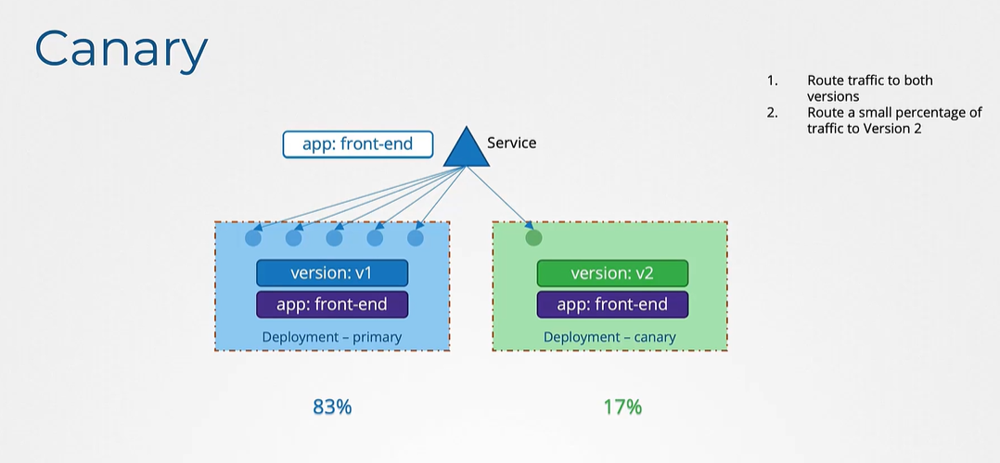

# Certified Kubernetes Administrator for Developers (CKAD) Course

[Revise Kubernetes for Beginners](../kubernetes_for_beginners/README.md)

<!-- Table of contents -->

# Commands and Args

In Docker, `ENTRYPOINT` and `CMD` are used to specify the command that runs when a container starts.

- `ENTRYPOINT` sets the main command to be executed.
- `CMD` provides default arguments for the `ENTRYPOINT` command.

```Dockerfile
FROM debian
ENTRYPOINT ["printenv"]
CMD ["sleep", "5000"]
```

In this example, `printenv` is the command that will run, and `sleep 5000` are the default arguments that can be overridden when the container is started.

- `command` - The command that is executed when the container starts
- `args` - The arguments that are passed to the command

```yaml
apiVersion: v1
kind: Pod
metadata:
  name: command-demo
spec:
  containers:
    - name: command-demo
      image: debian
      command: ["printenv"] # similar to ENTRYPOINT
      args: ["sleep", "5000"] # similar to CMD in Docker
```

# ConfigMaps

Environment Variables are key-value pairs that can be passed into a container. By setting environment variables, you can manage settings such as database connections, API keys, and other configuration details that might differ between development, testing, and production environments.

ConfigMaps are used to store configuration settings that can be consumed by other applications in the cluster. They are used to decouple configuration settings from the application code. ConfigMaps can be used to store individual key-value pairs or entire configuration files.

> Is ConfigMaps a resource like pods, services, deployments?

Yes, ConfigMaps are a resource in Kubernetes. They are used to store configuration settings that can be consumed by other applications in the cluster. Short form is `cm`.

- `kubectl create configmap <config-name> --from-literal=<key>=<value>` - Create a ConfigMap from key-value pairs

```yaml
apiVersion: v1
kind: ConfigMap
metadata:
  name: special-config
data:
  APP_COLOR: blue
  APP_MODE: prod
```

Injecting Environment Variables into a Pod

```yaml
apiVersion: v1
kind: Pod
metadata:
  labels:
    name: webapp-color
  name: webapp-color
spec:
  containers:
    - env:
        - name: APP_COLOR
          valueFrom:
            configMapKeyRef:
              name: webapp-config-map
              key: APP_COLOR
      image: kodekloud/webapp-color
      name: webapp-color
```

# Secrets

Secrets are used to store sensitive information, such as passwords, OAuth tokens, and SSH keys. They are similar to ConfigMaps but are specifically intended for sensitive data.

```sh
kubectl create secret generic db-secret --from-literal=username=admin --from-literal=password=secret
```

To use a Secret in a Pod, you can specify it in the Pod's configuration file:

```yaml
apiVersion: v1
kind: Pod
metadata:
  name: secret-demo
spec:
  containers:
    - name: secret-demo-container
      image: nginx
      env: # injecting single env vars one by one
        - name: DB_USERNAME
          valueFrom:
            secretKeyRef:
              name: db-secret
              key: username
        - name: DB_PASSWORD
          valueFrom:
            secretKeyRef:
              name: db-secret
              key: password
```

Loading all secrets from a Secret into a Pod at once

```yaml
apiVersion: v1
kind: Pod
metadata:
  name: webapp-pod
spec:
  containers:
    - name: webapp-container
      image: kodekloud/simple-webapp-mysql
      envFrom:
        - secretRef:
            name: db-secret
```

> Is secret data a resource like pods, services, deployments?

Yes, Secrets are a resource in Kubernetes. They are used to store sensitive information, such as passwords, OAuth tokens, and SSH keys. Secrets are similar to ConfigMaps but are specifically intended for sensitive data. Short form is `secret`.

> Secrets vs ConfigMaps ?

Secrets are used to store sensitive information, such as passwords, OAuth tokens, and SSH keys. They are similar to ConfigMaps but are specifically intended for sensitive data. But ConfigMaps are used to store configuration settings that can be consumed by other applications in the cluster. ConfigMaps can be used to store individual key-value pairs or entire configuration files.

Note - Secrets are not encrypted, they are just base64 encoded. So, they are not secure for storing sensitive data. Secrets are not encrypted in etcd databases.

etcdctl - command line tool for interacting with etcd
Secret data is actually stored in etcd database in plain-format. etcd is a key-value store used by Kubernetes to store all its data. You can interact with etcd using the etcdctl command line tool.

# Security ideas

We can define the user that runs the container in the Dockerfile using the `USER` instruction. This is useful for security reasons, as it helps to prevent the container from running as root. Also we can add capabilities to the container using the `--cap-add` and `--cap-drop` flags.

Pod level security context

```yaml
apiVersion: v1
kind: Pod
metadata:
  name: security-context-demo
securityContext: # Pod level security context
  runAsUser: 1000 # run as non-root user
spec:
  containers:
    - name: security-context-demo
      image: nginx
```

Container level security context

```yaml
apiVersion: v1
kind: Pod
metadata:
  name: security-context-demo
spec:
  containers:
    - name: security-context-demo
      image: nginx
      securityContext: # Container level security context
        runAsUser: 1000
        capabilities:
          add: ["MAC_ADMIN"]
```

Note - Capabilities are used to give additional permissions to the container. For example, the `MAC_ADMIN` capability allows the container to change network MAC addresses. You can add capabilities using the `--cap-add` flag in the `docker run` command. Capabilities can only be assigned at the container level, not the pod level.

# Service Accounts [TODO]

Service accounts are used to provide an identity for a pod. They are used to authenticate and authorize the pod to interact with the Kubernetes API server. Service accounts are associated with a set of credentials that are used to authenticate the pod to the API server. When a Pod runs in a Kubernetes cluster, it can use a Service Account to authenticate to the Kubernetes API server and access resources. Short form is `sa`.

User accounts - Used by humans to interact with the Kubernetes API server
Service accounts - Used by pods to interact with the Kubernetes API server. Eg - Prometheus, Jenkins

```yaml
apiVersion: v1
kind: ServiceAccount
metadata:
  name: my-service-account
spec:
  containers:
    - name: service-account-demo
      image: nginx
```

```yaml
apiVersion: v1
kind: Pod
metadata:
  name: service-account-demo
spec:
  serviceAccountName: my-service-account
  containers:
    - name: service-account-demo
      image: nginx
```

When service account is created, a secret is created automatically. This secret is mounted as a volume in the pod. This secret contains a token that is used to authenticate the pod to the API server.

Use RBAC (Role Based Access Control) to provide permissions to the service account.

> What if app is deployed on cluster?

If the app is deployed on a cluster, you can create a service account and associate it with the pod. The service account provides an identity for the pod, which can be used to authenticate and authorize the pod to interact with the Kubernetes API server. A volume is mounted in the pod that contains a secret with a token that is used to authenticate the pod to the API server.

# Resource requests, limits, LimitRange, ResourceQuota

Resource requests are used to specify the minimum amount of CPU and memory that a container needs to run. They are used to reserve resources for the container.

Resource limits are used to specify the maximum amount of CPU and memory that a container can use. They are used to prevent the container from using more resources than it needs.

kube-scheduler decides which node to place the pod on based on the resource requests and limits specified in the pod's configuration file.

```yaml
apiVersion: v1
kind: Pod
metadata:
  name: resource-demo
spec:
  containers:
    - name: resource-demo
      image: nginx
      resources:
        requests: # minimum resources allocated to the container
          memory: "64Mi"
          cpu: "250m"
        limits: # maximum resources that the container can use
          memory: "128Mi"
          cpu: "500m"
```

> What if container asks for more resources than limits?

If a container asks for more resources than the limits specified, the container will be terminated by the kubelet. The kubelet is responsible for managing the containers on a node and ensuring that they do not use more resources than they are allowed.

LimitRange - Used to set default values for resource requests and limits in a namespace for all pods

```yaml
apiVersion: v1
kind: LimitRange
metadata:
  name: limit-range-demo
spec:
  limits:
    - type: Container
      defaultRequest: # default values for resource requests
        memory: "64Mi"
        cpu: "250m"
      default: # default values for resource limits
        memory: "128Mi"
        cpu: "500m"
```

ResourceQuota - Used to set limits on the amount of resources that can be used in a namespace

```yaml
apiVersion: v1
kind: ResourceQuota
metadata:
  name: resource-quota-demo
spec:
  hard:
    requests.cpu: "1"
    requests.memory: 1Gi
    limits.cpu: "2"
    limits.memory: 2Gi
```

> What is the difference between ResourceQuota and LimitRange?

ResourceQuota is used to set limits on the amount of resources that can be used in a **namespace**.

LimitRange is used to set default values for resource requests and limits in a namespace for all pods. It is used to ensure that all pods in a namespace have the same resource requests and limits.

> The most important thing to do in solving a problem is to begin.
>
> – Frank Tyger

# Taints and Tolerations

Taints - added on nodes, repel pods

Toleration - added on pods, allows pods to be scheduled on nodes with taints

Taints are used to repel pods from nodes. They are used to prevent pods from being scheduled on nodes that do not have the required resources or are not suitable for the pod.

Tolerations are used to allow pods to be scheduled on nodes that have taints. They are used to specify that a pod can tolerate a taint on a node.

`kubectl taint nodes node1 key=value:taint-effect`

Taint effects can be one of the following:

- `NoSchedule` (default): Pods that do not tolerate the taint will not be scheduled on the node.
- `PreferNoSchedule`: Kubernetes will try to avoid scheduling pods that do not tolerate the taint on the node, but it is not guaranteed.
- `NoExecute`: Pods that do not tolerate the taint will be evicted from the node if they are already running.

`kubectl taint nodes node1 key=value:NoSchedule`

> Note - Taints are set on nodes and tolerations are set on pods.

```yaml
apiVersion: v1
kind: Pod
metadata:
  name: toleration-demo
spec:
  containers:
    - name: toleration-demo
      image: nginx
  tolerations:
    - key: "key"
      operator: "Equal"
      value: "value"
      effect: "NoSchedule"
```

Just because we have added taint to one node and toleration to one pod, we are not guarenteed that that pod will land up in that node. Tainting only tells that node to accept pods with certain tolerations.

> What if we have multiple nodes with same taints?

If you have multiple nodes with the same taints, you can add tolerations to the pods to allow them to be scheduled on those nodes. Tolerations are used to specify that a pod can tolerate a taint on a node.

> Neither comprehension nor learning can take place in an atmosphere of anxiety.
>
> – Rose Kennedy

# Node selectors and Affinity

Node selectors are used to specify which nodes a pod can be scheduled on. They are used to control which nodes a pod can be scheduled on based on labels assigned to the nodes.

```yaml
apiVersion: v1
kind: Pod
metadata:
  name: node-selector-demo
spec:
  containers:
    - name: node-selector-demo
      image: nginx
  nodeSelector: # Node selector is used to specify which nodes a pod can be scheduled on
    size: large
```

In this example, the pod will only be scheduled on nodes that have the label `size=large`.

Node Affinity is used to specify rules for scheduling pods based on the labels assigned to nodes. It is used to control which nodes a pod can be scheduled on based on the labels assigned to the nodes. It is superset of node selectors by providing more control over where pods are scheduled.

```yaml
apiVersion: v1
kind: Pod
metadata:
  name: node-affinity-demo
spec:
  containers:
    - name: node-affinity-demo
      image: nginx
  affinity:
    nodeAffinity:
      requiredDuringSchedulingIgnoredDuringExecution:
        nodeSelectorTerms:
          - matchExpressions:
              - key: size # Label key
                operator: In # Operator can be In, NotIn, Exists, DoesNotExist
                values: # Label values
                  - large
                  - medium
                  - small
```

In this example, the pod will only be scheduled on nodes that have the label `size=large`, `size=medium`, or `size=small`.

> What if there are no nodes with the label specified in node selector?

If there are no nodes with the label specified in the node selector, the pod will not be scheduled on any node. The pod will remain in the 'pending' state until a node with the required label is available. You can use node affinity to specify rules for scheduling pods based on the labels assigned to nodes.

- `kubectl label nodes <node-name> <label-key>=<label-value>` - Add a label to a node
- `kubectl get nodes --show-labels` - List all nodes along with their labels

# Multi container pods

Multi-container pods are pods that contain more than one container. They are used to run multiple containers that work together and share resources. Multi-container pods are used to run sidecar containers, helper containers, and other containers that provide additional functionality to the main container. Main idea for multi-container pods is to run helper containers that provide additional functionality to the main container and both interact with each other.

Mutli-container pods share the same lifecycle, network, and storage. They are used to run multiple containers that work together and share resources. No need for volume sharing between different containers in a pods.

For example, you can run a logging container that collects logs from the main container, or a monitoring container that monitors the main container.

```yaml
apiVersion: v1
kind: Pod
metadata:
  name: multi-container-pod
spec:
  containers: # multi-container pods
    - name: simple-webapp
      image: kodekloud/simple-webapp
    - name: log-agent
      image: kodekloud/log-agent
```

Design pattern in multi-container pods

1. Sidecar - Enhances or adds functionality to the main container (Imagine the sidecar on bike). Eg - Logging, monitoring, etc.
2. Ambassador - Acts as an intermediary between the main container and the external services (like DBs). Eg - Load balancer, proxy, etc.
3. Adapter - Converts the output of the main container into a different format. Eg - Convert logs into a different format, etc.

# Init containers

Init containers are containers that run before the main container in a pod. They are used to perform initialization tasks such as setting up configuration files, waiting for other services to be ready, and performing other tasks that need to be completed before the main container starts. That is a task that will be run only one time when the pod is first created. Or a process that waits for an external service or database to be up before the actual application starts. That's where initContainers comes in.

```yaml
apiVersion: v1
kind: Pod
metadata:
  name: myapp-pod
  labels:
    app: myapp
spec:
  containers:
    - name: myapp-container
      image: busybox:1.28
      command: ["sh", "-c", "echo The app is running! && sleep 3600"]
  initContainers:
    - name: warmup-1
      image: busybox
      command:
        ["sh", "-c", "echo Warming up... ; sleep 10 ; echo Warmup complete!"]
    - name: warmup-2
      image: busybox
      command:
        ["sh", "-c", "echo Warming up... ; sleep 10 ; echo Warmup complete!"]
```

You can configure multiple such initContainers as well, like how we did for multi-pod containers. In that case each init container is run one at a time in sequential order. If any of the initContainers fail to complete, Kubernetes restarts the Pod repeatedly until the Init Container succeeds.

> > Trick

```
controlplane ~ ➜  k edit pod red
error: pods "red" is invalid
A copy of your changes has been stored to "/tmp/kubectl-edit-2365671550.yaml"
error: Edit cancelled, no valid changes were saved.

controlplane ~ ✖ kubectl replace -f /tmp/kubectl-edit-2365671550.yaml --force
pod "red" deleted
```

Here we delete and replace the pod in one command by using --force flag.

# Observability

Observability is the ability to understand the internal state of a system by examining its outputs. It is used to monitor, debug, and troubleshoot applications running in a Kubernetes cluster.

Lifecycle of pod

`Pending -> ContainerCreating -> Running -> Succeeded/Failed -> Terminated`

# Readiness Probe

Readiness probes are used to determine if a container is ready to start accepting traffic. They are used to check if the application inside the container is ready to serve requests. If the readiness probe fails, the container will be removed from the service endpoints and will not receive any traffic.

```yaml
apiVersion: v1
kind: Pod
metadata:
  name: readiness-probe-demo
spec:
  containers:
    - name: readiness-probe-demo
      image: nginx
      readinessProbe: # readiness probe checks if the container is ready to accept traffic
        httpGet:
          path: /healthz # endpoint to check for readiness
          port: 80
        initialDelaySeconds: 5 # number of seconds to wait before performing the first probe
        periodSeconds: 10 # number of seconds between each probe
```

> what is meaning of probe?

A probe is a mechanism that periodically checks the health of an application running in a container. It is used to determine if the application is still running and ready to accept traffic. Probes are used to monitor the health of the application and ensure that it remains available and responsive.

Readiness probes can also be configured to use TCP or command-based checks:

```yaml
readinessProbe:
  tcpSocket:
    port: 8080
  initialDelaySeconds: 5
  periodSeconds: 10
```

```yaml
readinessProbe:
  exec:
    command:
      - cat
      - /tmp/healthy
  initialDelaySeconds: 5
  periodSeconds: 10
```

The service will not send traffic to the pod until the readiness probe passes. If the readiness probe fails, the pod will be removed from the service endpoints and will not receive any traffic.

# Liveness probe

Liveness probes are used to determine if a container is still running. They are used to check if the application inside the container is still alive and functioning. If the liveness probe fails, the container will be restarted by Kubernetes. This helps in recovering from situations where the application inside the container has crashed or is stuck in an unrecoverable state.

Liveness probes can be configured in the pod's configuration file:

```yaml
apiVersion: v1
kind: Pod
metadata:
  name: liveness-probe-demo
spec:
  containers:
    - name: liveness-probe-demo
      image: nginx
      livenessProbe:
        httpGet:
          path: /healthz # endpoint to check for liveness
          port: 80
        initialDelaySeconds: 5
        periodSeconds: 10
        failureThreshold: 6 # number of times the probe must fail before the container is restarted
```

Liveness probes can also be configured to use TCP or command-based checks:

```yaml
livenessProbe:
  tcpSocket:
    port: 8080
  initialDelaySeconds: 5
  periodSeconds: 10
  failureThreshold: 6
```

```yaml
livenessProbe:
  exec:
    command:
      - cat
      - /tmp/healthy
  initialDelaySeconds: 5
  periodSeconds: 10
  failureThreshold: 6
```

> Both readiness and liveness probe are added to the containers and not to the pod.

# Container Logging

Container logs are used to capture the output of a container. They are used to monitor the behavior of the container and troubleshoot issues that may arise. Container logs are stored in a file on the node where the container is running.

- `kubectl logs <pod-name>` - View the logs of a container
- `kubectl logs <pod-name> -c <container-name>` - View the logs of a specific container in a pod

# Monitoring a Cluster

Monitoring involves collecting, processing, and analyzing data to understand the performance and health of a system. It is essential for observing the behavior of a Kubernetes cluster and troubleshooting any issues that may arise.

Monitoring tools collect metrics, logs, and other data from a Kubernetes cluster to monitor its performance and health.

## Metrics Server

The Metrics Server collects resource usage data from the cluster, helping monitor the performance of the cluster and its components.

To enable the Metrics Server in Minikube, use the following command:

- `minikube addons enable metrics-server`
- `kubectl top node` - View resource usage metrics for nodes
- `kubectl top pod` - View resource usage metrics for pods

```sh
Pod
NAME    CPU(cores)   MEMORY(bytes)
nginx   0m           19Mi
```

```sh
Node
NAME       CPU(cores)   CPU(%)   MEMORY(bytes)   MEMORY(%)
minikube   133m         0%       943Mi           12%
```

# Pod design

Pod design is the process of designing and configuring pods to run applications in a Kubernetes cluster. It involves defining the containers, volumes, and other resources that make up the pod.

## Labels, Selectors and Annotations

Labels are key-value pairs attached to Kubernetes objects, such as pods, that are used to organize and select subsets of objects. They are used to identify and group objects based on specific criteria.

Selectors are used to filter and select objects based on their labels. They are used to specify which objects should be included in a particular operation, such as selecting pods for a service or deployment.

Annotations are key-value pairs attached to Kubernetes objects that are used to store arbitrary metadata. They are used to provide additional information about an object that is not used for identification or selection.

Labels are added to a pod's configuration file:

```yaml
apiVersion: v1
kind: Pod
metadata:
  name: label-demo
  labels:
    app: myapp
    environment: production
spec:
  containers:
    - name: label-demo
      image: nginx
```

Selectors are used to filter and select objects based on their labels:

```yaml
apiVersion: v1
kind: Service
metadata:
  name: myapp-service
spec:
  selector:
    app: myapp
  ports:
    - protocol: TCP
      port: 80
      targetPort: 80
```

Annotations are extra metadata added to a pod's configuration file:

```yaml
apiVersion: v1
kind: Pod
metadata:
  name: annotation-demo
  annotations:
    description: "This is a demo pod"
    owner: "admin"
spec:
  containers:
    - name: annotation-demo
      image: nginx
```

- `kubectl get pods --show-labels` - List all pods along with their labels
- `kubectl label pods <pod-name> <label-key>=<label-value>` - Add a label to a pod
- `kubectl annotate pods <pod-name> <annotation-key>=<annotation-value>` - Add an annotation to a pod

## Rolling Updates

Rolling updates allow you to update the application without downtime. Kubernetes gradually replaces the old version of the application with the new version, ensuring that the application remains available during the update process.

```yaml
apiVersion: apps/v1
kind: Deployment
metadata:
  name: myapp-deployment
spec:
  replicas: 3
  selector:
    matchLabels:
      app: myapp
  template:
    metadata:
      labels:
        app: myapp
    spec:
      containers:
        - name: myapp-container
          image: myapp:1.0
```

To perform a rolling update, you can update the image of the deployment:

```yaml
apiVersion: apps/v1
kind: Deployment
metadata:
  name: myapp-deployment
spec:
  replicas: 3
  selector:
    matchLabels:
      app: myapp
  template:
    metadata:
      labels:
        app: myapp
    spec:
      containers:
        - name: myapp-container
          image: myapp:2.0
```

- `kubectl rollout status deployment/<deployment-name>` - Check the status of a rollout
- `kubectl rollout history deployment/<deployment-name>` - View the rollout history of a deployment

# Rollbacks

If there is an issue with the new version of the application, you can roll back to the previous version.

- `kubectl rollout undo deployment/<deployment-name>` - Roll back to the previous version
- `kubectl rollout undo deployment/<deployment-name> --to-revision=<revision-number>` - Roll back to a specific revision


# Deployment stratergy

Deployment strategies are used to control how updates are applied to applications running in a Kubernetes cluster. They are used to manage the rollout of new versions of the application and ensure that the application remains available during the update process.

1. Blue Green Deployment - In this strategy, two identical environments are created, one for the current version of the application (blue) and one for the new version of the application (green). Traffic is routed to the green environment, and once the new version is verified, traffic is switched to the green environment, and the blue environment is decommissioned.


2.  Canary Deployment - In this strategy, a small percentage of traffic is routed to the new version of the application to test its performance and stability. If the new version is successful, more traffic is gradually shifted to the new version until it is fully deployed.



3. A/B Testing - In this strategy, two versions of the application are deployed, and traffic is split between the two versions to test different features or configurations. This allows you to compare the performance of the two versions and make data-driven decisions about which version to deploy.

4. Rolling Update - In this strategy, the new version of the application is gradually rolled out to the cluster, ensuring that the application remains available during the update process. Kubernetes replaces the old version of the application with the new version, one pod at a time, until the update is complete.

# Jobs & CronJobs

Jobs - Jobs are used to run a task to completion. They are used to run a task once and then stop. If the task fails, the job can be restarted to ensure that it completes successfully.

CronJobs - CronJobs are used to run tasks on a schedule. They are used to run a task at a specific time or interval. CronJobs are similar to cron jobs in Unix systems.

```yaml
apiVersion: batch/v1 # note batch/v1 - Jobs are part of batch API group
kind: Job
metadata:
  name: example-job
spec:
  completions: 3 # number of times the job should run
  parallelism: 2 # number of pods that run in parallel
  template:
    spec:
      containers:
        - name: example
          image: busybox
          command: ["echo", "Hello, Kubernetes!"]
      restartPolicy: OnFailure # k8s will restart the job if it fails
      backoffLimit: 4 # number of retries before considering the job as failed
```

```yaml
apiVersion: batch/v1
kind: CronJob
metadata:
  name: example-cronjob
spec:
  schedule: "*/1 * * * *" # run every minute
  jobTemplate:
    spec:
      template:
        spec:
          containers:
            - name: example
              image: busybox
              command: ["echo", "Hello, Kubernetes!"]
          restartPolicy: OnFailure
```

# Ingress Networking

Ingress is an API object that manages external access to services in a Kubernetes cluster. It is used to expose HTTP and HTTPS routes from outside the cluster to services within the cluster. Ingress is used to configure routing rules, load balancing, and SSL termination for services running in a Kubernetes cluster.


Ingress Controller - An Ingress Controller is a component that manages the Ingress objects in a Kubernetes cluster. It is responsible for implementing the routing rules defined in the Ingress objects and forwarding traffic to the appropriate services.


Ingress Resource - An Ingress Resource is an API object that defines the routing rules for external access to services in a Kubernetes cluster. It is used to configure routing rules, load balancing, and SSL termination for services running in the cluster.

```yaml
apiVersion: networking.k8s.io/v1
kind: Ingress
metadata:
  name: example-ingress
spec:
  rules:
    - http:
      paths:
        - path: /wear
          pathType: Prefix
          backend:
            service:
              name: wear-service
              port:
                number: 80
        - path: /eat
          pathType: Prefix
          backend:
            service:
              name: eat-service
              port:
                number: 80
```

> You don't get what you wish for. You get what you work for.
>
> – Daniel Milstein

In simple terms, Ingress is a way to route external HTTP and HTTPS traffic to services in a Kubernetes cluster.

# Network Policies

Network Policies are used to control the flow of traffic between pods in a Kubernetes cluster. They are used to define rules that specify which pods can communicate with each other and on which ports. Network Policies are used to enforce security policies and restrict access to sensitive resources.

Ingress - incoming traffic, Egress - outgoing traffic

Example - creating a network policy inside db saying allowing only ingress traffic from port 3306, rest other ports are blocked.

```yaml
apiVersion: networking.k8s.io/v1
kind: NetworkPolicy
metadata:
  name: db-network-policy
spec:
  podSelector:  # pods to which the policy applies
    matchLabels:
      role: db
  policyTypes: # types of traffic to allow
    - Ingress
  ingress:
    - from:
        - podSelector: # pods from which the traffic is allowed
            matchLabels:
              role: frontend
          namespaceSelector: # namespaces from which the traffic is allowed
            matchLabels:
              project: prod
        - ipBlock: # IP blocks from which the traffic is allowed
            cidr: 192.168.5.10/32
        ports:
          - protocol: TCP
            port: 3306
  egress:
    - to:
        - podSelector:
            matchLabels:
              role: frontend
          namespaceSelector:
            matchLabels:
              project: prod
        - ipBlock:
            cidr:
```


Both podSelector and namespaceSelector must be followed or ipblock spec to request db resources

> The greatest glory in living, lies not in never falling, but in rising every time we fall.
>
> – Nelson Mandela

---

# State Persistence

# Volumes

Volumes are used to store data in a pod. They are used to persist data across container restarts and ensure that the data is available to all containers in the pod. Volumes are used to store configuration files, databases, logs, and other data that needs to be shared between containers.

Volumes are mounted in a pod's configuration file:

```yaml
apiVersion: v1
kind: Pod
metadata:
  name: volume-demo
spec:
  containers:
    - name: volume-demo
      image: nginx
      volumeMounts:
        - mountPath: /usr/share/nginx/html
          name: html-volume
  volumes:
    - name: html-volume
      hostPath:
        path: /data/html
        type: Directory
```

In this example, a volume named `html-volume` is mounted at the path `/usr/share/nginx/html` in the container. The volume is backed by a hostPath volume that is mounted at the path `/data/html` on the host machine.

Storage solutions - NFS, Cluster FS, Flocker, Fiber Channel, CFS, Scale IO, or public cloud solutions like AWS, EBS, Azure Disc or file or Google 's Persistent Disk.

```yaml
volumes:
  - name: html-volume
    awsElasticBlockStore:
      volumeID: <volume-id>
      fsType: ext4
```

# Persistent Volumes

Persistent Volumes are used to store data in a Kubernetes cluster. They are used to persist data across pod restarts and ensure that the data is available to all pods in the cluster. Persistent Volumes are used to store configuration files, databases, logs, and other data that needs to be shared between pods.

> Volumes vs Persistent Volumes ?

Volumes are used to store data in a pod, while Persistent Volumes are used to store data in a Kubernetes cluster. Volumes are used to persist data across container restarts and ensure that the data is available to all containers in the pod. Persistent Volumes are used to persist data across pod restarts and ensure that the data is available to all pods in the cluster.

```yaml
apiVersion: v1
kind: PersistentVolume
metadata:
  name: pv-demo
spec:
  accessModes: # access modes for the volume - ReadWriteOnce, ReadOnlyMany, ReadWriteMany
    - ReadWriteOnce
  capacity:
    storage: 1Gi
  persistentVolumeReclaimPolicy: Retain # what happens to the volume when it is deleted
  hostPath:
    path: /data/pv-demo
```

Persistent Volumes Claim - Persistent Volume Claims are used to request storage in a Kubernetes cluster. They are used to request a Persistent Volume with specific storage requirements, such as size and access mode. One PVC (Persistent Volume Claim) can only be bound to one PV (Persistent Volume).

Binding algo ? - PVs are bound to PVCs based on the storage class, access mode, and storage capacity specified in the PVC.

```yaml
apiVersion: v1
kind: PersistentVolumeClaim
metadata:
  name: pvc-demo
spec:
  accessModes:
    - ReadWriteOnce
  resources:
    requests:
      storage: 500Mi
```

Using PVC in pods - PVCs are used to request storage in a Kubernetes cluster. They are used to request a Persistent Volume with specific storage requirements, such as size and access mode.

```yaml
apiVersion: v1
kind: Pod
metadata:
  name: pv-pod-demo
spec:
  containers:
    - name: pv-container-demo
      image: nginx
      volumeMounts:
        - mountPath: /usr/share/nginx/html
          name: pv-storage
  volumes:
    - name: pv-storage
      persistentVolumeClaim:
        claimName: pvc-demo
```

The same is true for ReplicaSets or Deployments. Add this to the pod template section of a Deployment on ReplicaSet.

> Real difficulties can be overcome; it is only the imaginary ones that are unconquerable.
>
> – Theodore N. Vail

<!-- Storage Classes and Stateful Sets are optional and not part of the exam curriculum -->

# Storage classes

Storage Classes are used to define different types of storage in a Kubernetes cluster. They are used to define the properties of the storage, such as the type of storage, the access mode, and the reclaim policy. Storage Classes are used to provision Persistent Volumes dynamically based on the storage requirements specified in a Persistent Volume Claim.

Dynamic provisioning - Storage Classes are used to provision Persistent Volumes dynamically based on the storage requirements specified in a Persistent Volume Claim. They are used to automatically create Persistent Volumes when a Persistent Volume Claim is created.

```yaml
apiVersion: storage.k8s.io/v1
kind: StorageClass
metadata:
  name: standard
provisioner: kubernetes.io/aws-ebs
parameters:
  type: gp2
  fsType: ext4
```

While creating PVC we just need to specify the storage class name. The respective PV will automatically be created while creating PVC.

```yaml
apiVersion: v1
kind: PersistentVolumeClaim
metadata:
  name: pvc-demo
spec:
  storageClassName: standard # storage class name
  accessModes:
    - ReadWriteOnce
  resources:
    requests:
      storage: 500Mi
```

> Those who hoard gold have riches for a moment.
> Those who hoard knowledge and skills have riches for a lifetime.
>
> – The Diary of a CEO

# Stateful Sets

<!-- [Skip] -->

Stateful Sets are used to manage stateful applications in a Kubernetes cluster. They are used to manage applications that require stable, unique network identifiers and persistent storage. Stateful Sets are used to manage applications that require ordered deployment, scaling, and termination.

Sequential order of creation of pods

> Stateful sets vs Deployments?

Stateful Sets are used to manage stateful applications in a Kubernetes cluster, while Deployments are used to manage **stateless** applications. Stateful Sets are used to manage applications that require stable, unique network identifiers and persistent storage, while Deployments are used to manage applications that do not require stable, unique network identifiers and persistent storage.

# Headless services

Headless Services are used to create services without a cluster IP. They are used to create services that do not have a cluster IP and do not load balance traffic to pods. Headless Services are used to create services that provide DNS records for pods without load balancing traffic to the pods.

```yaml
apiVersion: v1
kind: Service
metadata:
  name: headless-service
spec:
  clusterIP: None # no cluster IP
  selector:
    app: myapp
  ports:
    - protocol: TCP
      port: 80
      targetPort: 80
```

In this example, a Headless Service named `headless-service` is created with a cluster IP of `None`. The service does not have a cluster IP and does not load balance traffic to pods.

<!-- Revise above points before going forward -->

---

# SECURITY in k8s

# Authentication

Authentication is the process of verifying the identity of a user or system. It is used to ensure that the user or system is who they claim to be. Authentication is used to control access to resources and services in a Kubernetes cluster.

kube-apiserver - The kube-apiserver is the component of the Kubernetes control plane that provides the API server for the cluster. It is used to authenticate and authorize users and systems to access the Kubernetes API. kube-apiserver is responsible for handling authentication and authorization requests from users and systems.

All network connections from kube-apiserver to other k8s components are secured using TLS.

Types of users -

1. Users Accounts - User Accounts are used by 'humans' to interact with the kube-apiserver. They are used to authenticate and authorize users to access the Kubernetes API.

2. Service Accounts - Service Accounts are used by 'pods' to interact with the kube-apiserver. They are used to authenticate and authorize pods to access the Kubernetes API.

# KubeConfig

KubeConfig is a file used to configure access to a Kubernetes cluster. It is used to specify the cluster, user, and context information needed to access the cluster. KubeConfig is used to configure access to a Kubernetes cluster from the command line.

KubeConfig file is located at `~/.kube/config` by default.

```yaml
apiVersion: v1
kind: Config
clusters:
  - name: my-cluster
    cluster:
      server: https://my-cluster:6443
      certificate-authority-data: <base64-encoded-ca-cert>

users:
  - name: my-user
    user:
      client-certificate-data: <base64-encoded-client-cert>
      client-key-data: <base64-encoded-client-key>

contexts: # context is used to specify the cluster, user, and namespace
  - name: my-context
    context:
      cluster: my-cluster
      user: my-user
      namespace: my-namespace
```

> What is cluster, users and contexts?

Cluster - A cluster is a set of nodes that run containerized applications. It is used to manage the resources and services in a Kubernetes cluster.

User - A user is an entity that interacts with the Kubernetes API server. It is used to authenticate and authorize users and systems to access the Kubernetes API.

Context - A context is used to specify the cluster, user, and namespace information needed to access a Kubernetes cluster. It is used to configure access to a Kubernetes cluster. So that I know which user can access which cluster.

- `kubectl config view` - View the current KubeConfig settings
- `kubectl config get-contexts` - List all the contexts in the KubeConfig file
- `kubectl config use-context <context-name>` - Switch to a different context

> If you can't explain it simply you don't understand it well enough.
>
> – Albert Einstein

# API Groups & Versions

API Groups are used to organize and manage resources in a Kubernetes cluster. They are used to group related resources together and provide a way to manage them as a single unit.

Types of API Groups -

- `metrics.k8s.io` - Metrics API group is used to collect resource usage data from the cluster. It is used to monitor the performance of the cluster and its components.
- `healthz` - Healthz API group is used to check the health of the cluster. It is used to monitor the health of the cluster and ensure that it remains available and responsive.
- `logs.k8s.io` - Logs API group is used to collect logs from the cluster. It is used to monitor the behavior of the cluster and troubleshoot issues that may arise.
- `version` - Version API group is used to check the version of the cluster. It is used to check the version of the cluster and ensure that it is up to date.
- `api` - API API group is used to manage the resources in the cluster. It is used to manage the resources and services in the cluster.
- `apis` - APIs API group is used to manage the resources in the cluster. It is used to manage the resources and services in the cluster.

core apis, named groups api
List of items in core api

/api
/v1
-> namespaces, pods, rc, events, endpoints, nodes, bindings, PV, PVC, configmaps, secrets, services

/apis
/apps/v1
-> deployments, replicasets, statefulsets, daemonsets
/networking.k8s.io/v1
-> networkpolicies, ingresses
/storage.k8s.io/v1
-> storageclasses, volumeattachments
/certificate.k8s.io/v1
-> certificatesigningrequests, certificates
/authentication.k8s.io/v1
-> tokenreviews, subjectaccessreviews, localsubjectaccessreviews, selfsubjectaccessreviews

All words under -> are called as resources in k8s.

/v1 -> GA/stable, generally availability
/v1alpha1 -> Alpha release (not recommended for production)
/v1beta1 -> Beta release

> What is kubelet and kube-proxy?

Kubelet - The kubelet is the primary node agent that runs on each node in a Kubernetes cluster. It is responsible for managing the containers on the node and ensuring that they are running and healthy.

Kube-Proxy - The kube-proxy is a network proxy that runs on each node in a Kubernetes cluster. It is responsible for routing traffic to the appropriate services in the cluster.

> kube proxy vs kubectl proxy ?

Kube-Proxy is a network proxy that runs on each node in a Kubernetes cluster, while Kubectl Proxy is a proxy server that runs on the local machine and provides access to the Kubernetes API server. Kube-Proxy is responsible for routing traffic to the appropriate services in the cluster, while Kubectl Proxy is used to access the Kubernetes API server from the local machine.

# Authorization

Authorization is the process of determining what actions a user or system is allowed to perform. It is used to control access to resources and services in a Kubernetes cluster. Authorization is used to ensure that users and systems have the necessary permissions to access the resources and services in the cluster.

# Role Based Access Control (RBAC)

Role Based Access Control (RBAC) is used to control access to resources and services in a Kubernetes cluster. It is used to define roles and permissions for users and systems to access the resources and services in the cluster. RBAC is used to ensure that users and systems have the necessary permissions to access the resources and services in the cluster.

Roles - Roles are used to define permissions for users and systems to access resources in a Kubernetes cluster. They are used to define what actions a user or system is allowed to perform on a resource.

Eg - Create a role for Developer, Security, Admin, etc.

# Roles and RoleBindings

```yaml
apiVersion: rbac.authorization.k8s.io/v1
kind: Role
metadata:
  name: developer-role
rules:
  - apiGroups: [""]
    resources: ["pods"] # resources to access
    resourceNames: ["my-pod"] # specific resources to access
    verbs: ["get", "list", "create"]
  - apiGroups: ["apps"]
    resources: ["deployments"]
    verbs: ["get", "list", "create"]
```

Rolebinding - Rolebindings are used to bind roles to users and systems in a Kubernetes cluster. They are used to grant permissions to users and systems to access resources in the cluster.

```yaml
apiVersion: rbac.authorization.k8s.io/v1
kind: RoleBinding # RoleBinding is used to bind roles to users
metadata:
  name: developer-rolebinding
roleRef: # role to bind
  kind: Role
  name: developer-role
  apiGroup: rbac.authorization.k8s.io
subjects: # users to bind
  - kind: User
    name: developer
    apiGroup: rbac.authorization.k8s.io
# roleRef <-> subjects
```

`k describe pod kube-apiserver-minikube -n kube-system` - Describe the pod to check the kube-apiserver pod.

Note - Roles and Rolebindings are created within namespaces.

> Success doesn't come from what you do occasionally. It comes from what you do consistently.
>
> – Marie Forleo

# Cluster Roles

To grant permissions across a whole cluster, you can use a ClusterRoleBinding.

```yaml
apiVersion: rbac.authorization.k8s.io/v1
kind: ClusterRole
metadata:
  name: secret-reader
rules:
  - apiGroups: [""]
    resources: ["secrets"]
    verbs: ["get", "list"]
```

```yaml
apiVersion: rbac.authorization.k8s.io/v1
kind: ClusterRoleBinding
metadata:
  name: read-secrets-global
subjects:
  - kind: Group
    name: manager
    apiGroup: rbac.authorization.k8s.io
roleRef:
  kind: ClusterRole
  name: secret-reader
```

# Namespace based vs Cluster scoped resources

Namespace based resources - pods, replica sets, deployments, services, secrets, configmaps, roles, rolebindings, etc.

`k api-resources --namespaced` - List all namespace based resources

Cluster scoped resources - nodes, persistent volumes, storage classes, cluster roles, cluster role bindings, etc.

`k api-resources --namespaced=false` - List all cluster scoped resources

Earlier we were talking about roles and rolebindings which are namespace based resources. But what if you want to grant permissions across the whole cluster? That's where ClusterRoles and ClusterRoleBindings come in.

# Admission Controllers

Admission Controllers are used to enforce stricter policies and rules for resources in a Kubernetes cluster. They are used to validate and mutate resources before they are created, updated, or deleted. Admission Controllers are used to enforce security policies, resource limits, and other rules for resources in the cluster. Like enforcing pods to pull images from internal registry only.

Eg - AlwaysPullImages, LimitRanger, ResourceQuota, DefaultStorageClass, (NamespaceExists, NamespaceAutoProvision) -> NamespaceLifecycle, etc.

kubectl command -> Authentication -> Authorization -> Admission Controller -> kube-apiserver

Mutating admission controller - change requests
Validating admission controller - validate requests

Custom Admission Controllers - MutatingAdmissionWebhook, ValidatingAdmissionWebhook

AdmissionWebhook Server - Own logic to validate or mutate requests

<!-- Skip Custom resources, custom controllers, operator framework -->

# Helm Fundamentals

Helm is a package manager for Kubernetes that is used to deploy and manage applications in a Kubernetes cluster. It is used to package, install, and upgrade applications in a Kubernetes cluster. Helm is used to manage the lifecycle of applications in a Kubernetes cluster.

- `curl -fsSL -o get_helm.sh https://raw.githubusercontent.com/helm/helm/master/scripts/get-helm-3` - Download the Helm installation script
- `helm search repo` - Search for charts in the Helm repository
- `helm repo add <repo-name> <repo-url>` - Add a Helm repository
- `helm install <chart-name>` - Install a chart
- `helm upgrade <release-name> <chart-name>` - Upgrade a release
- `helm rollback <release-name> <revision>` - Roll back a release to a previous revision
- `helm list` - List all releases
- `helm delete <release-name>` - Delete a release
