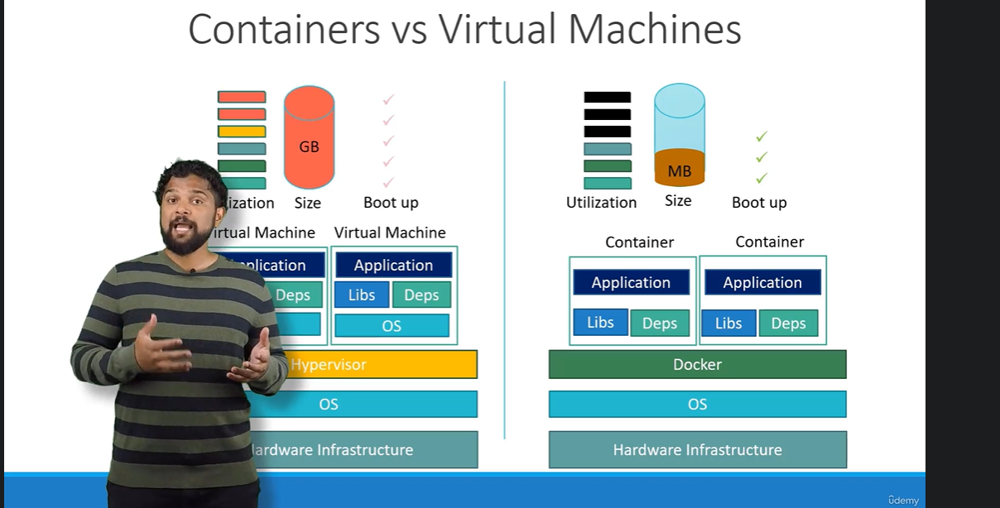
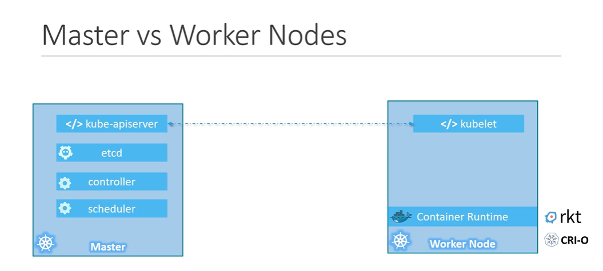
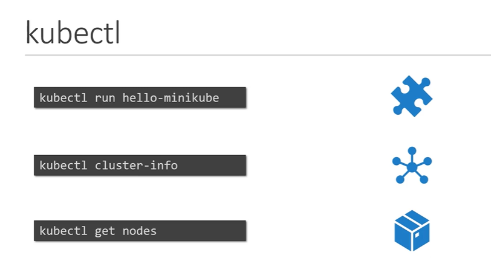
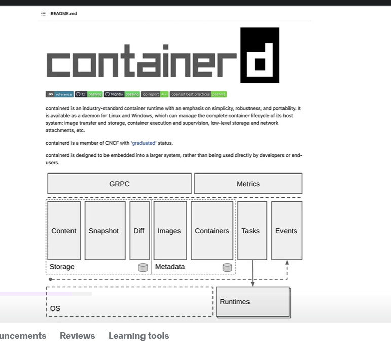
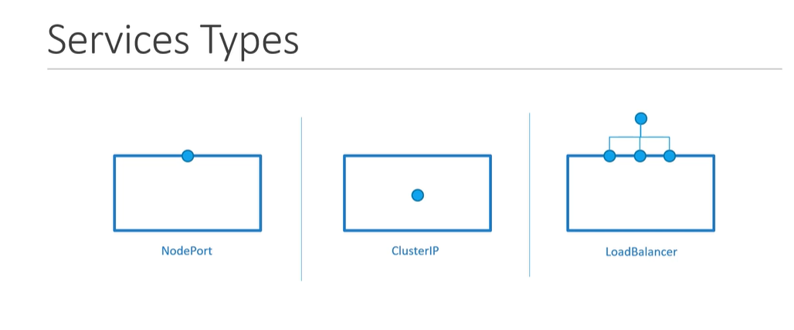
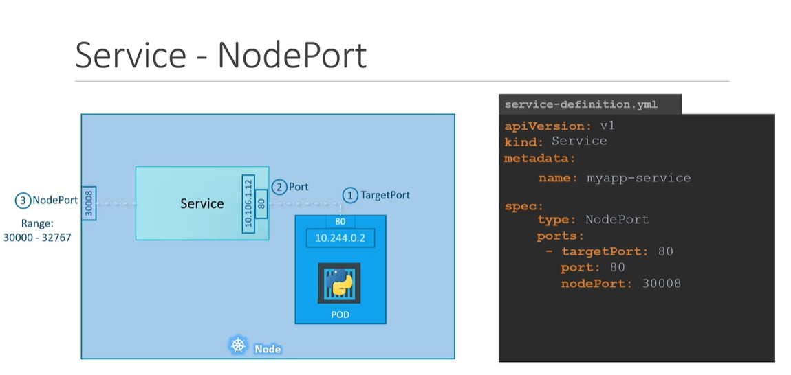
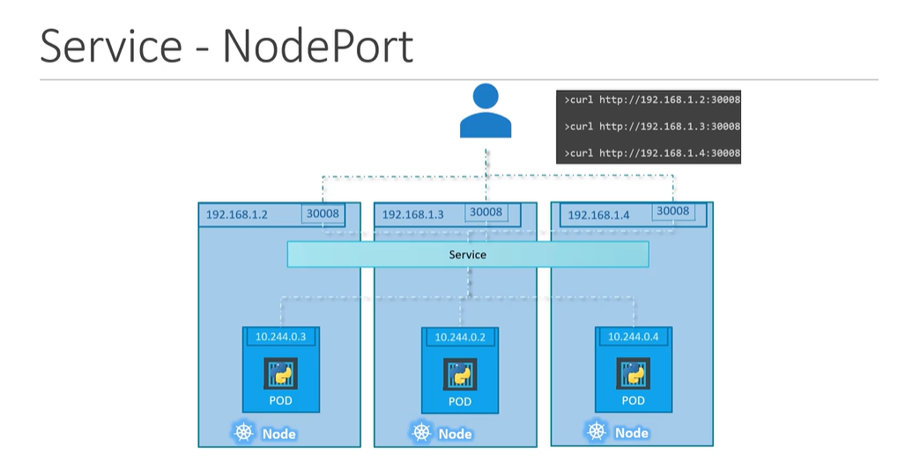

# Kubernetes for the absolute beginners

1. [Kubernetes](#kubernetes)
2. [Docker](#docker)
3. [Kubernetes Architecture](#kubernetes-architecture)
4. [Components of Kubernetes](#components-of-kubernetes)
5. [Master vs Worker Nodes](#master-vs-worker-nodes)
6. [kubectl](#kubectl)
7. [Docker vs containerd](#docker-vs-containerd)
8. [Pods](#pods)
9. [Replica Sets](#replica-sets)
10. [Deployments](#deployments)
11. [Namespaces](#namespaces)
12. [Kubernetes Networking](#kubernetes-networking)
13. [Services](#services)
14. [Microservices Architecture](#microservices-architecture)
15. [Kubernetes on Cloud](#kubernetes-on-cloud)
16. [Tips](#tips)

# Kubernetes

Kubernetes is a container orchestration tool that is used to deploy, scale, and manage containerized applications. It is a powerful tool that can be used to manage complex applications in a scalable way. Kubernetes is an open-source platform that was developed by Google and is now maintained by the Cloud Native Computing Foundation (CNCF).

# Docker

Docker containers are the building blocks of Kubernetes. Containers are lightweight, portable, and self-sufficient. They are used to package applications and their dependencies in a way that makes them easy to deploy and run. Containers are isolated from each other and from the host system, which makes them secure and reliable.


# Kubernetes Architecture

**Nodes** - A node is a physical or virtual machine that runs the Kubernetes software. Nodes are the workhorses of the Kubernetes cluster. They run the applications and services that make up the cluster.

**Master Node** - The master node is the control plane of the Kubernetes cluster. It is responsible for managing the cluster, scheduling applications, and monitoring the health of the cluster. The master node consists of several components, including the API server, the scheduler, the controller manager, and etcd.

**Worker Node** - A worker node is a node that runs the applications and services that make up the Kubernetes cluster. Worker nodes are managed by the master node and communicate with the master node to receive instructions and report their status.

**Cluster** - A set of nodes that run the Kubernetes software. A cluster consists of a master node and one or more worker nodes. The master node is responsible for managing the cluster, while the worker nodes run the applications and services.

# Components of Kubernetes

**API Server** - The API server is the front end of the Kubernetes control plane. It exposes the Kubernetes API, which allows users to interact with the cluster. The API server is responsible for processing requests, validating them, and updating the state of the cluster.

**etcd** - etcd is a distributed key-value store that is used to store the state of the Kubernetes cluster. It is a highly available and consistent store that is used by the master node to store configuration data, state information, and other cluster data.

**Scheduler** - The scheduler is responsible for scheduling pods and services on the worker nodes. It takes into account factors such as resource requirements, affinity, anti-affinity, taints, tolerations and other constraints when making scheduling decisions.

**Controllers** - Controllers are responsible for managing the state of the cluster. They monitor the state of the cluster and take action to ensure that the desired state is maintained. There are several types of controllers in Kubernetes, including the Replication Controller, the ReplicaSet, the Deployment, and the StatefulSet.

**Container Runtime** - The underlying software that is used to run containers. Kubernetes supports several container runtimes, including Docker, containerd, rocket, and CRI-O.

**Kubelet** - The kubelet is an agent that runs on each worker node and is responsible for managing the containers on that node. It communicates with the master node to receive instructions and report the status of the containers. Also used in logging and monitoring.

# Master vs Worker Nodes

**Master Nodes** - kube-apiserver, kube-scheduler, kube-controller-manager, etcd

**Worker Nodes** - kubelet, kube-proxy, container runtime (docker in our case)



# kubectl

kubectl is the command-line tool that is used to interact with the Kubernetes cluster. It is used to deploy applications, inspect the cluster, and perform other administrative tasks. kubectl communicates with the API server to send requests and receive responses.

**Commands:**

- `kubectl run [name] --image=[image]` - Deploy an application
- `kubectl cluster-info` - Get information about the cluster
- `kubectl get nodes` - Get information about the nodes in the cluster



# Docker vs containerd



containerd is an industry-standard core container runtime.

> Is containerd the daemon for running docker containers?

No, containerd is not a daemon for running docker containers. It is a core container runtime that provides a set of APIs for managing containers and images. Docker is a platform that uses containerd as its core container runtime. Docker provides a higher-level API that makes it easier to build, ship, and run containers.

> What is the daemon for running docker containers?

The daemon for running docker containers is the Docker Engine. The Docker Engine is a client-server application that runs on the host machine and manages the containers. It provides a REST API that allows users to interact with the containers and images.

> What is docker shim?

It acted as a bridge between Kubernetes and the Docker runtime. It was responsible for translating Kubernetes CRI requests into Docker API calls. With the introduction of containerd as the default container runtime in Kubernetes, the need for the Docker shim was eliminated.

> So docker is an abstraction layer that sits on top of containerd and provides a higher-level API for managing containers and images. Docker uses containerd as its core container runtime to manage the containers.

# Pods

Pods are the smallest unit of deployment in Kubernetes. A pod is a group of one or more containers that are deployed together on a single node. Pods are used to run applications and services in Kubernetes. Each pod has its own IP address and can communicate with other pods in the cluster.

**Commands:**

- `kubectl run nginx --image=nginx` - Create a pod running the nginx container
- `kubectl apply -f pod.yaml` - Create/update pods from YAML (pod.yaml contains the pod definition)
- `kubectl delete pod [name]` - Delete pods by name
- `kubectl get pods` - Get all pods
- `kubectl describe pod [name]` - Get detailed information about a pod

`kubectl create` is used to create a resource, if already created then it will throw an error. `kubectl apply` is used to create a resource, if already created then it will update the resource. Use `kubectl apply` for creating/updating resources.

```yaml
apiVersion: v1 # version of the API
kind: Pod # type of resource (pod, service, deployment, etc.)
metadata: # metadata of the pod
  name: nginx-pod
  labels: # any labels can be added here (key-value pairs)
    app: myapp
    type: front-end
    description: nginx-web-server

spec: # specification of the pod
  containers: # list of containers in the pod
    - name: nginx
      image: nginx:1.14.2
      ports:
        - containerPort: 80
    - name: ubuntu-conatiner
      image: ubuntu:18.04
      command: ["sh", "-c", "echo Hello Kubernetes! && sleep 3600"]
```

# Replica Sets

<!-- Replication controllers skipped as older tech -->

**Replica Sets** - A ReplicaSet is a higher-level abstraction that manages pods. ReplicaSets are used to ensure that a specified number of pod replicas are running at all times. ReplicaSets are used to scale applications and provide fault tolerance. Short form of replica set is `rs`.

A selector is used to match pods that are controlled by the ReplicaSet. The ReplicaSet will create and manage pods that match the selector. Use only replica sets for managing replicas in Kubernetes.

**Commands:**

- `kubectl create -f replicaset.yaml` - Create replica sets
- `kubectl get replicaset` - Get all replica sets
- `kubectl edit replicaset [name]` - Edit replica sets
- `kubectl scale --replicas=NUMBER -f replicaset.yaml` - Scale replica sets
- `kubectl replace -f replicaset.yaml --force` - Replace replica sets (force update)

```yaml
apiVersion: apps/v1
kind: ReplicaSet
metadata:
  name: myapp-replicaset
  labels:
    app: myapp
    type: front-end

spec:
  replicas: 4 # number of replicas
  selector: # selector to match pods
    matchLabels:
      type: front-end
  template:
    metadata:
      labels:
        type: front-end # labels for the pods (this should match the selector)
    spec:
      containers:
        - name: nginx
          image: nginx:1.14.2
```

# Deployments

**Deployments** - A deployment is a higher-level abstraction that manages replica sets. Deployments are used to deploy and manage applications in Kubernetes. Deployments provide features such as rolling updates, rollbacks, and scaling.

Deployment strategy - The deployment strategy is used to control how updates are applied to the pods. There are two strategies available: rolling update and recreate.

**Commands:**

- `kubectl get deployments` - Get all deployments
- `kubectl describe deployment [name]` - Describe deployments
- `kubectl edit deployment [name]` - Edit deployments - perform a rolling update
- `kubectl scale --replicas=NUMBER deployment [name]` - Scale deployments
- `kubectl rollout status deployment [name]` - Check rollout status
- `kubectl rollout history deployment [name]` - Check rollout history
- `kubectl set image deployment [name] [container_name]=image:tag` - Update deployment image
- `kubectl rollout undo deployment [name]` - Rollback deployment

Upgradation process - New replica set is created, pods are created in the new replica set, old replica set is scaled down, old replica set is deleted.

Rollback process - Old replica set is scaled up, new replica set is scaled down, new replica set is deleted.

```yaml
apiVersion: apps/v1
kind: Deployment
metadata:
  name: myapp-deployment
  labels:
    app: myapp
    type: front-end

spec:
  replicas: 4
  selector:
    matchLabels:
      type: front-end
  template: # has a pod definition inside it
    metadata:
      labels:
        type: front-end
    spec:
      containers:
        - name: nginx
          image: nginx
```

# Namespaces

**Namespaces** - Namespaces are used to organize and partition resources in Kubernetes. Namespaces provide a way to group resources together and provide isolation between different teams or projects. Namespaces are used to avoid naming conflicts and to provide resource quotas.

kube-system namespace - The kube-system namespace is used to store system resources and components that are used by Kubernetes. It contains resources such as the API server, the scheduler, the controller manager, and other system components.

**Commands:**

- `kubectl create namespace [name]` - Create a namespace
- `kubectl get namespaces` - Get all namespaces
- `kubectl get pods --namespace=[namespace]` - Get pods in a namespace
- `kubectl delete namespace [name]` - Delete a namespace
- `kubectl config set-context --current --namespace=[namespace]` - Set the default namespace

Use-case - Creating both dev and prod namespaces, deploying the same application in both namespaces, and then making changes in the dev environment. This way, we can test the changes in the dev environment before deploying them to the prod environment.

> Short form of namespace is ns, and --namespace can be replaced with -n

# Kubernetes Networking

Kubernetes networking - Kubernetes provides a powerful networking model that allows pods to communicate with each other and with external services. Kubernetes networking is based on the concept of a network plugin, which is responsible for setting up the networking rules and policies for the cluster.

IP addresses are assigned to pods and not containers. Containers in the same pod share the same network namespace and can communicate with each other using localhost. Different pods can communicate with each other using the pod IP address.

# Services

**Services** - A service is an abstraction that defines a logical set of pods and a policy by which to access them. Services provide a stable IP address and DNS name for pods, which allows other pods to communicate with them. Services are used to expose applications and services to other pods in the cluster. Services enable communication between different pods in the cluster.

Services enable connectivity between different pods in the cluster. Services enable loose coupling between microservices. They are just like k8s objects, and they are used to expose the application to the outside world.



**NodePort** - Exposes the service on each Node's IP at a static port. A ClusterIP service is automatically created, and you can access the service from outside the cluster using `NodeIP:NodePort`.
Here `nodePort` is the port on which the service is exposed on each node. The range for NodePort is 30000-32767.

Port mapping from nodePort to targetPort is done in the service definition.

```yaml
apiVersion: v1
kind: Service
metadata:
  name: myapp-nodeport
spec:
  type: NodePort
  selector:
    app: myapp
  ports:
    - port: 80
      targetPort: 80
      nodePort: 30007
```





The service is applied to all the nodes and all the pods in multicontainer scenarios. The service is applied to all the pods that match the selector.

**ClusterIP** - Exposes the service on a cluster-internal IP, making it reachable only within the cluster. This is the default ServiceType. It is used to expose the service to other pods in the cluster. Here `targetPort` is the port on which the service is running in the pod.

Each layer can talk to another layer using a facade pattern. The service is used to expose the application to other pods in the cluster.

```yaml
apiVersion: v1
kind: Service
metadata:
  name: myapp-clusterip
spec:
  type: ClusterIP # default service type
  selector: # link the service to the pods
    app: myapp
  ports:
    - port: 80
      targetPort: 80
```

Here the service is exposed to the pods that match the selector. The service is not exposed to the outside world.

**LoadBalancer** - Exposes the service externally using a cloud provider's load balancer. NodePort and ClusterIP services, to which the external load balancer will route, are automatically created. Here `targetPort` is the port on which the service is running in the pod.

```yaml
apiVersion: v1
kind: Service
metadata:
  name: myapp-loadbalancer
spec:
  type: LoadBalancer
  selector:
    app: myapp
  ports:
    - port: 80
      targetPort: 80
```

# Microservices Architecture

Microservices - Microservices is an architectural style that structures an application as a collection of small, loosely coupled services. Each service is responsible for a specific task or function and communicates with other services using APIs. Microservices enable teams to work independently, scale services independently, and deploy services independently.

**Voting application deployment from Kubernetes** - Voting application is a simple web application that allows users to vote on a poll. The application consists of five services: vote, redis, worker, db, and result. Each service is deployed as a separate pod in the Kubernetes cluster.

**Components:**

1. Voting interface - Created using Python Flask
2. Redis - In-memory data structure store
3. Worker - Processes the votes and stores the results in the database, created using C#
4. Database - Stores the results of the votes, created using PostgreSQL
5. Result interface - Displays the results of the votes, created using Node.js

# Kubernetes on Cloud

Google Kubernetes Engine (GKE), Amazon Elastic Kubernetes Service (EKS), and Azure Kubernetes Service (AKS) are managed Kubernetes services that make it easy to deploy, manage, and scale containerized applications with Kubernetes.

# Tips

Here are some of the commonly used output formats for `kubectl` commands:

- `-o json` - Output a JSON formatted API object.
- `-o name` - Print only the resource name and nothing else.
- `-o wide` - Output in the plain-text format with any additional information.
- `-o yaml` - Output a YAML formatted API object.

> Note - Delete pods matching certain pattern
> kubectl delete $(kubectl get pods -o name | grep [pattern])
